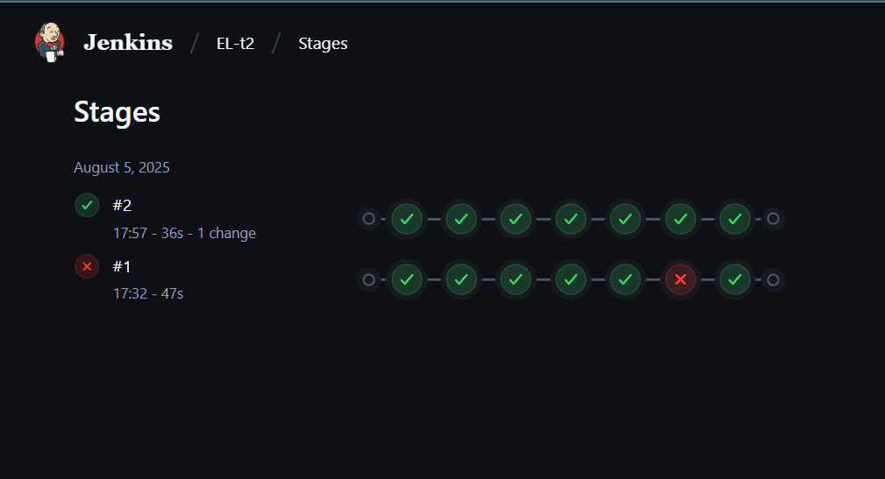

# DevSecOps CI/CD Pipeline for EL-t2 Node.js App

This project demonstrates a complete DevSecOps CI/CD pipeline using Jenkins, integrating both static code analysis via SonarQube and container security scanning via Trivy. The goal is to enforce code quality and vulnerability management automatically during the build and deployment process.

---

## Overview

### Key Features

- **Source Code Checkout:** Clones the main branch from the GitHub repository.
- **Dependency Installation & Testing:** Installs Node.js dependencies and runs tests to ensure application correctness.
- **Static Code Analysis (SonarQube):** Analyzes code quality, security vulnerabilities, bugs, and code smells using SonarQube.
- **Container Image Build:** Builds a Docker image for the Node.js application.
- **Vulnerability Scanning (Trivy):** Scans the built Docker image for HIGH and CRITICAL vulnerabilities.
- **Docker Image Push:** Pushes the vetted Docker image to Docker Hub.
- **Security Gates:** The pipeline fails if SonarQube reports severe issues or Trivy finds critical vulnerabilities.

---

## Tools Used

- **Jenkins:** Orchestrates the CI/CD pipeline.
- **SonarQube:** Performs static application security testing (SAST).
- **Trivy:** Container vulnerability scanner.
- **Docker:** Builds and pushes container images.
- **GitHub:** Source code repository.

---

## Jenkins Pipeline (Jenkinsfile)

Below is the Jenkins pipeline code integrating both SonarQube and Trivy security scans:

pipeline {
    agent any

    environment {
        DOCKER_IMAGE = 'el-t2-node-app:latest'
        SONARQUBE_SCANNER = 'SonarQubeScanner' // SonarQube scanner tool configured in Jenkins
        SONAR_TOKEN = credentials('SONAR_TOKEN') // SonarQube token from Jenkins credentials
    }

    stages {
        stage("Code Checkout") {
            steps {
                // Clone the GitHub repository into Jenkins workspace
                git url: 'https://github.com/Harshil-k4/EL-t2.git', branch: 'main'
                echo 'Code cloned successfully to workspace'
            }
        }

        stage("Install Dependencies") {
            steps {
                // Install node modules in the checked out repository
                sh 'npm ci'
            }
        }

        stage("Run Tests") {
            steps {
                sh 'npm test'
            }
        }

        stage("Static Code Analysis - SonarQube") {
            steps {
                withSonarQubeEnv('SonarQube Server') {
                    // Run SonarQube analysis on the checked-out code
                    sh "${SONARQUBE_SCANNER} -Dsonar.login=${SONAR_TOKEN}"
                }
            }
        }

        stage("Quality Gate") {
            steps {
                timeout(time: 1, unit: 'MINUTES') {
                    waitForQualityGate abortPipeline: true
                }
            }
        }

        stage("Build Docker Image") {
            steps {
                // Build Docker image from the checked-out repository files in the workspace
                sh "docker build -t ${DOCKER_IMAGE} ."
                echo 'Docker build successful'
            }
        }

        stage("Trivy Security Scan") {
            steps {
                // Run Trivy security scan on the Docker image
                sh "trivy image --severity HIGH,CRITICAL --exit-code 1 --format table -o trivy-report.txt ${DOCKER_IMAGE}"
                sh "cat trivy-report.txt"
            }
            post {
                always {
                    archiveArtifacts artifacts: 'trivy-report.txt', allowEmptyArchive: true
                }
            }
        }

        stage("Push to DockerHub") {
            steps {
                // Use Jenkins credentials securely to login and push Docker image
                withCredentials([usernamePassword(credentialsId: 'dhc', usernameVariable: 'dockerUser', passwordVariable: 'dockerPass')]) {
                    sh '''
                        echo "$dockerPass" | docker login -u "$dockerUser" --password-stdin
                        docker tag ${DOCKER_IMAGE} $dockerUser/el-t2-node-app:latest
                        docker push $dockerUser/el-t2-node-app:latest
                    '''
                }
                echo 'Push successful'
            }
        }
    }

    post {
        always {
            sh 'docker logout'
        }
        success {
            echo 'Pipeline completed successfully!'
        }
        failure {
            echo 'Pipeline failed! Check the logs.'
        }
    }
}

---

## How to Use

1. **Configure Jenkins:**
   - Install the SonarQube Scanner plugin.
   - Setup SonarQube server configuration in Jenkins.
   - Add SonarQube authentication token as a secret credential (id: `SONAR_TOKEN`).
   - Add Docker Hub credentials (id: `dhc`).

2. **Trivy Setup:**
   - Install Trivy on Jenkins agents that run the pipeline.

3. **Run Pipeline:**
   - Create a Jenkins pipeline job and point it to your GitHub repo’s `main` branch Jenkinsfile.
   - On each commit, the pipeline will run and enforce quality and security gates.

---

## Benefits

- Automated identification of code vulnerabilities and security risks.
- Incorporates container security checks as part of CI/CD.
- Prevents insecure or low quality code/images from progressing to deployment.
- Streamlines DevSecOps practices in your development lifecycle.

---
## outputs

logs from jenkins

docker image uploaded into dockerhub representing deployment

---

**By Harshil Kumar — Elevate Labs DevOps Internship Task Day2**